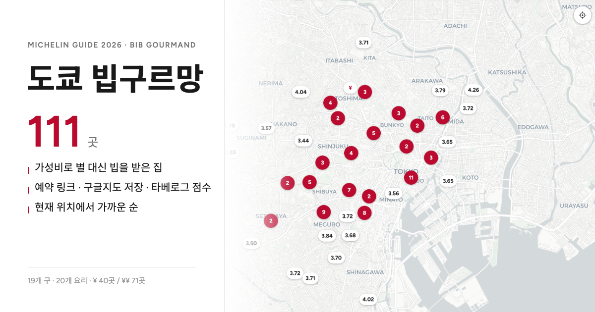

# 도쿄 빕구르망 111

**→ https://jailoutprompt.github.io/tokyo-bib/**

MICHELIN Guide 2026 도쿄 빕구르망 선정 **111곳**. 아이폰 기준 단일 HTML.



## 기능

| | |
|---|---|
| **예약** | 미쉐린이 각 업장에 연결해 둔 예약 파트너(TableCheck 28 · OMAKASE 21) 링크. 파트너가 없으면 전화 → 공식 홈페이지 → 타베로그 순으로 대체. **111곳 전부 최소 하나의 예약 수단 보유** |
| **구글지도 저장** | 111곳 전부 Google place ID를 확보해 정확한 업장을 연다. 구글이 "목록에 저장" API를 공개하지 않으므로 저장 버튼은 열린 화면에서 한 번 더 눌러야 한다 |
| **타베로그 점수** | 핀에 점수를 직접 표기. 4.00 이상 = 전체 상위 0.07%, 3.50 이상 = 상위 3% (카카쿠컴 공식 기준) |
| **백명점 교차** | 타베로그 백명점 동시 선정 49곳 표시 |
| **가까운 순** | 현재 위치 기준 거리 정렬 |
| **필터** | 요리 계통 · 가격 · 19개 구 · 정렬 |

## 데이터 커버리지

| 항목 | 확보 | 출처 |
|---|---|---|
| 좌표 · 주소 · 인스펙터 코멘트 · 사진 | 111 / 111 | guide.michelin.com |
| 일본어 상호 | 111 / 111 | guide.michelin.com (ja) |
| Google place ID | 111 / 111 | Google Maps |
| 타베로그 페이지 | 107 / 111 | tabelog.com |
| 타베로그 점수 | 105 / 111 | tabelog.com |
| 온라인 예약 파트너 | 49 / 111 | guide.michelin.com |
| 전화번호 | 100 / 111 | guide.michelin.com |
| 공식 홈페이지 | 54 / 111 | guide.michelin.com |
| 백명점 선정 | 49 / 111 | tabelog.com |

분포 — 시부야 18 · 주오 14 · 미나토 14 · 신주쿠 11 (19개 구)
요리 — 프렌치 19 · 라멘 15 · 소바 12 · 이탈리안 11 · 돈카츠 8 (20종)
가격 — ¥ 40곳 / ¥¥ 71곳

## 디자인 근거

색·타이포·비율은 취향이 아니라 **guide.michelin.com 배포 CSS 실측값**을 따랐다.

```
--red:  #ba0b2f   /* 미쉐린 CSS에서 124회. 빕구르망 심볼 fill 값과 동일 */
--gold: #af8d5a   /* 18회. 보더·아이콘 전용, 텍스트 금지 */
--ink:  #191919   --sub: #757575   --line: #cccccc
--shadow: 0 0 8px 0 rgba(0,0,0,.2)   /* 그림자는 이 하나만 */
--radius: 3px
사진 비율 6:5 (미쉐린 셀렉션 카드) · 본문 line-height 1.5 · 제목 1.2
폰트 Figtree + Noto Sans KR (미쉐린 공식 한국어 폴백 조합)
```

지도 UI 수치는 Apple HIG · Material 3 · Airbnb 실계측 기준.

```
바텀시트 3단 스냅 (peek / 50% / 100dvh−72px)   M3 top margin 72dp
그래버 32×4px, 히트영역 48×48px, 탭하면 detent 순환   HIG "tap it to cycle"
핀 높이 28px, radius 999, 13px/700, 히트영역 44px   Airbnb 실측 · HIG 44pt
핀 선택 = 색 반전 + scale 1.08 (형태 불변)   Airbnb 실측 80.1×28 → 86.3×30.2
핀 그림자 0 2px 4px rgba(0,0,0,.18) + 0 0 0 1px rgba(0,0,0,.08)
Leaflet 기본 마커(25×41)·기본 줌 컨트롤(26px) 미사용 — 44pt 기준 미달
basemap 탈채도 (CARTO light) — HIG "muted style"
```

## 파일

| 파일 | 용도 |
|---|---|
| `index.html` | 지도 본체. 데이터 내장 단일 파일 |
| `tokyo-bib-gourmand-111.csv` | 구글 **내 지도** 임포트용. 예약·구글지도 링크 컬럼 포함 |
| `tokyo-bib-gourmand-111.kml` | 내 지도 임포트용 (설명·링크 유지) |

## 갱신

미쉐린 선정은 매년, 타베로그 점수는 매월 제1·제3 화요일에 바뀐다.
`index.html` 안의 `<script id="payload">` JSON만 교체하면 된다.

---

데이터 수집 2026-08-19 · Built with Aside
